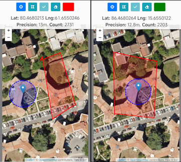

# GPS-Location-Verification-Map

# GeoCheck

## Description
A page that receives GPS data from the same device and checks if it is within a defined area.

## Technologies Used
- **HTML, CSS, and JavaScript** for structure and functionality.  
- **Leaflet.js** for interactive map management.  
- **OpenStreetMap** as the primary map provider.  
- **Esri World Imagery** for high-resolution satellite imagery.  
- **Turf.js** for advanced geospatial analysis and calculations.  
